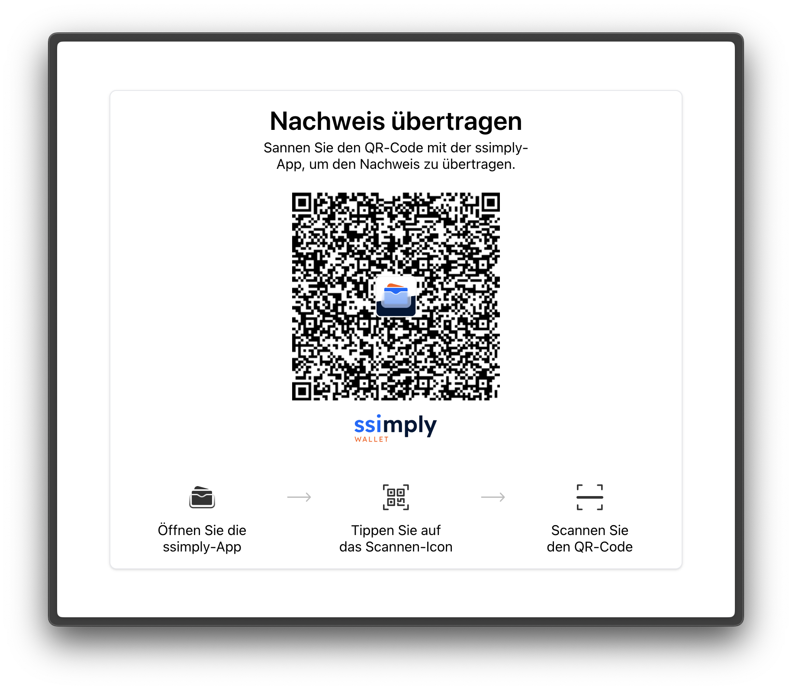

<div align="center">
  <a href="https://ubique.ch" target="_blank">
    
    
  </a>
</div>

# SSI Issuer Elements

This library provides components that can be used to display a qr code to transfer a proof to the ssimply wallet.

## Installation

```bash
pnpm install @ubique-innovation/ssi-issuer-elements
```

## Usage

The components can either be included using browser-native web components or with the generated React components. If the components are used in any environment but React, use the native web components. To do so, import the script file for each web component separately.

If you are using React, import the components from `@ubique-innovation/ssi-issuer-elements/react`.

### Setup

Before including any component, be sure to initialize the global configuration:

```tsx
import { config } from "@ubique-innovation/ssi-issuer-elements";

config.init({ baseUrl: "https://base.url" });
```

## Components

### Transfer Proof



#### Usage

```tsx
// web component
import "@ubique-innovation/ssi-issuer-elements/transfer-proof";

<ssi-transfer-proof token="your-token">
  <a href="/">
    <button>Fertig</button>
  </a>
</ssi-transfer-proof>;
```

```tsx
// react
import { SsiTransferProof } from "@ubique-innovation/ssi-issuer-elements/react";

<SsiTransferProof token="your-token">
  <a href="/">
    <button>Fertig</button>
  </a>
</SsiTransferProof>;
```

#### Attributes

| name    | type     | default | required | description                                 |
| ------- | -------- | ------- | -------- | ------------------------------------------- |
| `token` | `string` | –       | yes      | the token that is used to create the invite |

#### Slot

The children are inserted into the confirmation screen. This slot is intended to show a button that links to some other screen after the proof was transferred successfully.
